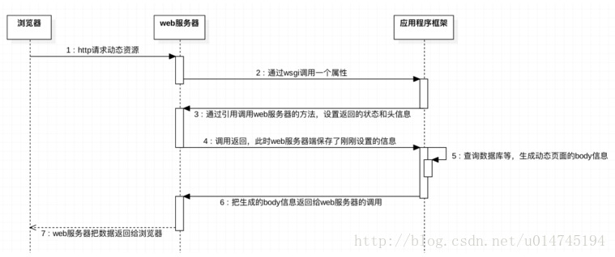

## HTTP请求  
> <a href="https://www.liaoxuefeng.com/wiki/0014316089557264a6b348958f449949df42a6d3a2e542c000/001432011939547478fd5482deb47b08716557cc99764e0000">传送门</a>      
> 响应代码：200表示成功，3xx表示重定向，4xx表示客户端发送的请求有错误，5xx表示服务器端处理时发生了错误   
> WSGI：web serve gataway interface(关联CGI[common gate way interface]     
> application() 一个处理函数     
> 
>     
### 框架的由来
>：为了方便维护，每一个URL设置一个处理函数
> FLASK，Django     
### MVC
>(Model-View-Controller)   
> M->dict,V->HTML(template),
```python

#!/usr/local/bin/python
# coding=utf-8
 
from flask import Flask
app = Flask(__name__)
 
@app.route('/')
def hello_world():
    return 'Hello World!'
 
if __name__ == '__main__':
    app.run(host='0.0.0.0',port=9000)
'''
第4行，引入Flask类，Flask类实现了一个WSGI应用
第5行，app是Flask的实例，它接收包或者模块的名字作为参数，但一般都是传递__name__。
让flask.helpers.get_root_path函数通过传入这个名字确定程序的根目录，以便获得静态文件和模板文件的目录。
第7~9行，使用app.route装饰器会将URL和执行的视图函数的关系保存到app.url_map属性上。
处理URL和视图函数的关系的程序就是路由，这里的视图函数就是hello_world。
第11行，使用这个判断可以保证当其他文件引用这个文件的时候（例如“from hello import app”）不会执行这个判断内的代码，也就是不会执行app.run函数。
第12行，执行app.run就可以启动服务了。默认Flask只监听虚拟机的本地127.0.0.1这个地址，端口为5000。
而我们对虚拟机做的端口转发端口是9000，所以需要制定host和port参数，0.0.0.0表示监听所有地址，这样就可以在本机访问了。
服务器启动后，会调用werkzeug.serving.run_simple进入轮询，默认使用单进程单线程的werkzeug.serving.BaseWSGIServer处理请求，
实际上还是使用标准库BaseHTTPServer.HTTPServer，通过select.select做0.5秒的“while TRUE”的事件轮询。
当我们访问“http://127.0.0.1:9000/”,通过app.url_map找到注册的“/”这个URL模式,就找到了对应的hello_world函数执行，返回“hello world!”,状态码为200。
如果访问一个不存在的路径，如访问“http://127.0.0.1:9000/a”,Flask找不到对应的模式，就会向浏览器返回“Not Found”，状态码为404
'''
```