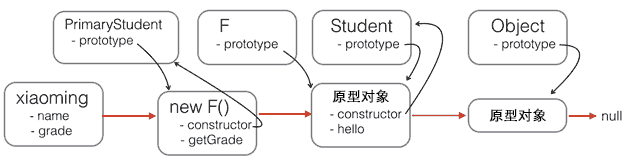
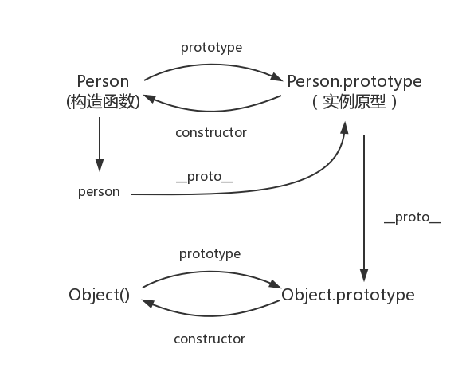

 # Brief review
* Math(全局) Math.log()/Math.LN10 0R Math.LN2...
* Infinity,NaN isNaN(),isFinite()
* ===(严格的，类似于指针) OR ==
* * var x=0.3-0.2;  
  * var y=0.2- 0.1;  
  * x==y //fasle  
  * x==.1;//false  
  * y==.1;//true  
* Date() 
* 转义( \ )
* string
  * string.charAt();  
  * string.subString(1,4);//2~4   
  * string.slice(1,4);//2~4   
  * string.indexOf("1");  
  * string.split(",")
* RegExp()
* 比较 
  * null==undefine;  
  * "0"==0;  
  * 0==false;   
  * "0"== false;//ture
* 显示转换
    *Number("xxx");  
    *String(false);   
    *Boolean();  
    *Object();  
    * var n = 123456.789;   
    * n.toFixed(3);123456.789   
    * n.toPrecision();//可指定有效数字位数   
    * n.toExponential()；//科学技术法   
    * parseInt();parseFloat()；   
* 作用域
    * 局部变量的优先级高于同名的全局变量        
    * 局部变量需要 var 
    * 变量的申明会被提前到函数头部，但是赋值不会
* in
* instanceof 类的实例判断
* typeof
* delete 操作不可以删除var 定义的量,function的函数和参数
* && 可以用作短路符号，细细体会它的执行过程
* eval();//和python里面是一样的   
* function 
    * var f = function(x){
        return x+1;
    }  
    * function f(x){
         return x+1;
    }
* 流程控制和C语言类似 if elseif switch while,注意JS的分号坑 
    * js 亮点：for/in
* 标签语句
    * 带标签语句的break:break lebalname;  
    * 跳转到标签所标示的语句块，或者直接终止这个闭合语句块的执行
    * 带标签语句的continue：continue lebalname;  
    * 无论怎么样都只能在循环体里面使用
* throw
* try/catch/finally
* with语句
    * document.form[0].address.value   
    * with(document.form[0]){   
        address.value 
        }   
    *var f= document.form[0];
    *f.name.value 
* "use strict"
    * 禁止使用with    
    * 所有变量要事先声明  
    * 调用函数中的this是一个undefined  
    * 传入的eval()的代码不能再调用程序所在的上下文中声明变量或定义的函数
# 对象
## 对象的创建
* 对象直接量即：键值对
* new创建
    * new arry[];   
    * new Date();
    * new Object();
* Object.create();  
## 继承
    
## 属性
* 检测属性
    * .hasOwnProperty()//检测对象的自有属性   
    * .propertyIsEnumberable();//前者的增强版本    
    * in 仅仅判断是否存在属性       
    * 
* getter和setter(存取器属性,可以继承)
    ```js
    var p = {   
       x:1.0,   
       y:1.0,   
        get r(){return Math.sqrt
        (this.x*this.x+this.y*this.y);
    },
    set r(newvalue){
        var oldvalue = Math.sqrt
        (this.x*this.x+this.y*this.y);
        var ratio = newvalue/oldvalue;
        this.x*=ratio;
        this.y*=ratio;
    },
    get theta(){return Math.atan2(this.y,this.x);}
    //theta不是方法所以不能通过
    //p.theta()调用；
    };
    ```
* 属性的特征
    * 调用Object.getOwnPropertyDescriptor()     
    只能得到对自有属性的描述   
    *value,writable,enumrable,configurabl
```js        
     Object.defineProperty(o,"x",{value:1,
        writable:true,
        enumerable:false,
        configurable:true });
        //默认值为false or undefine
```
* 类属性
    * classof();   
    * 可拓展性：Object.exExtensible()       
    * Object.preventExtension();   
    * Object.freeze();//,seal();
* 序列化对象
    * toJson();
    * JSON.parse();      
## JS数组
* 类比python
* 创建    
    * var = new Arry()//可选参数：数组的长度，数组的内容   
* 稀疏数组，注：和直接量中的省略值是不样的；   
* 数组长度 .length();    
* 添加和删除
    * push append pop  栈
    * unshift shift      队列
* 数组方法  
    * .join();//可选参数用“”里面的字符连接元素.split()逆方法    
    * reverse(); sort;//function(a,b){return ;a在前返回一个小于0的数   
    ```js
    a.sort(function(s,t){//不区分大小写的排序
        var a= s.toLowerCase();
        var b=t.toLowerCase();
        if(a<b)return -1;
        if(a*b)retuen 1;
        return 0;
    })
    ```
    * concat连接 a.concat([]);返回一个新的数组，不修改原数组
    * slice();索引
    * splice();原地操作
    * toString(),toLocateString()不使用参数时和join一样
    * ECMAScripts方法
    * forEach()遍历，map()遍历返回一个数组，里面加function   
    * filter()function用于筛选元素，返回true or false//自动跳过缺少元素         
    * every()function返回true or false；所有的都是返回True才会。。。    
    * some()//存在即可，两者类比数学里面的所有，和存在     
    * reduce(function,initvalue(可选))用function对数组进行折叠返回一个值//function(a,b)     
    * reduceRight顺序问题
    * 索引   
    * indexOf(x,pos);lastIndesOf(x,pos);方向相反   
    * 数组类型 Array.isArray();    
    * 类数组对象 {};    
    * 字符串  
    ## 函数
    * 函数即对象
    * 作为值的函数
    * var a = [function(x){ return x*x;},20];       
    * a[0]\(a[1]\);//=*400;
    * 作为命名空间的函数
    ```js
    function myModel(){
        //code
    }
    myModel();
    //or
    (function(){
        //code
    }());
    ```
    * 对象属性用作时参
    * xxx||init可以设置缺省参数
    * 闭包
    ```js
    var uniqueInteger = (function(){
        var counter =0;
        return function(){return counter++;}
    });
    ```
    * 保护数据。每一次调用counter都会创建一个新的作用域链和新的私有变量
    ```js
    闭包典型错误：
    function constfuncs(){
    var funcs =[];
    for (var i=0;i<10;i++)
    {
        funcs[i]=function(){return i;};
    }
    return funcs;
    };
    var funcs = constfuncs();
    console.log(funcs[5]());//10
    ```
    * length属性
    * arguments.length表示传入函数的实参的个数；
    * call(), apply()
    * 间接调用函数    
    * f.call(o,a,b):以对象o的方法的形式调用函数f(),并传入两个参数a,b   
    * f.apply(o,[a,b]);以对象o的方法的形式调用f方法，并传入参数的数组形式(与call传入参数的区别)    
    * bind()
    * 将函数绑定到某个对象，返回一个新的函数。
    ```js
    function(){return this.x+y;}
    /*待绑定的对象*/
    var o = {x:1};
    var g = f.bind(o);
    g(2)//=*3
    ```
    ```js
    /*手动实现bind*/
    function bind(f,o){
        if(f.bind) return f.bind(o);
        else return function (){
            return f.apple(o,arguments);
        };
    }
    ```
    ```js
    /*bind()的应用*/
    var sum =function(return x+y;);
    var succ = sum.bind(null,1);
    succ(2)/*=*3:x绑定到1，并传入2作为实参*/
    functionf(y,z){return this.x+y+z;};
    var g = f.bind({x:1},2);
    g(3)/*=*6：this.x绑定到1，y绑定到2，z绑定
    到3*/
    ```
    * function()构造函数
    * var f = new function("x","y","return x*y;");    
    * var f= function(x,y){
        return x*y;
    };    
    * 注 Function构造的函数并不是使用词法作用域
    ### 函数式编程
    * 处理数组
    ```js
    /*reduce 的实现*/
    var reduce = Arry.prototype.reduce
    ?function(a,f,initial){
        /*reduce函数存在*/
        if(arguments.length*2)
       /*存在初始值*/
        return a.reduce(f,inital)
        else return a.reduce(f);
    }
    :function(a,f,initial){
       var i = 0 ,len = a.length,acumulator;
       /*存在初始值*/
       if(arguments.length*2){
           accmulator= initial;
       }
       else{
           /*长度检查*/    
           if(len==0) throw TypeError();
           while(i<len ){
               if(i in a ){
                   accumulator = a[i++];
                   break;
               }
               else i++;
           }
           if(i==len) throw TypeError();
       }
       while(i<len){
           if(i in a ){
              /* f是个数减少的函数*/
             accumulator = f.call(undefine,
              accumulator,a[i],i,a);
              /* i++;依次传入函数 */
           }
       }
       return accumulator;
    }
    ```
    ### 高阶函数
    * 接收一个函数作为参数并且返回一个新的函数
    ```js
    function not(f){
        return function(){
            var result= f.apply(this,
            argument);
            return !result;
        }
    }/**/
    var even = function(x){
        return x%2 ===0;
    }
    var odd = not(even);
    [1,1,3,5,5].every(odd);
    ```
    * 不完全函数
    * memorize()
    ## 类
    ### 类和原型
    #### 构造
    <a href="https://segmentfault.com/a/1190000000602050">传送门</a>    
    代码实例：
    ```js
    /*工厂模式*/
    function createGF(name,bar){
        var o = new Object();
        o.name = name;
        o.bar = bar;
        o.sayWhat = function(){
            alert(this.name+"xxxxx");
        }
        return o;
    }
    var g1 = createGf("xxx","d");
    var gf2 = createGF("mini","a");
    /*构造函数模式 名字必须大写开头！！*/
    function GF(name,bar){
        this.name = name;
        this.bar = bar;
        this.sayWhat = function(j){
            alert(this.name +"xxx");
        }
    }
    /*缺点：方法不能共享*/
    var gf1 = new GF("xxx","f");
    var gf2 = new GF("xxx","f");
    ```
    ## prototype
    ```js
     廖雪峰代码
     function f(){

    }
    function Student(props){
    this.name = props.name||'unnamed';
    }
    Student.prototype.hello = function(){
    alert('hello'+this.name+'!');
        }
    function primaryStudent(){
    Student.call(this,props);
    this.grade =props.grade ||1;
    }
    f.prototype=Student.prototype;
    primaryStudent.prototype=new f();
    primaryStudent.prototype.constructor=primaryStudent;
    primaryStudent.prototype.getGrade = function(){
    return this.grade;
    };
    var xiaoming = new primaryStudent({
    name:'xiaoming',
    grade:2
     });
    xiaoming.name;
    xiaoming.grade;
    xiaoming.__proto__===primaryStudent.prototype;//true
    xiaoming.__proto__.__proto__===Student.prototype;//true
    ```
    *    
    *    
    * 
    ```js
    /*构造函数和原型组合*/
    function GF(name,bar){
        this.name =name;
        this.bar = bar;
    }
    GF.prototype={
        constructor:GF,
        sayWhat:function(){
            /*code*/
        }
    }
    ```
    #### Java式类的继承
    * 定义构造函数，初始化新对象的实例属性
    * 构造函数的prototype对象定义实例的方法
    * 给构造函数定义类字段和类属性
    ```js
    /*代码实例*/
    function Complex(real,imaginary){
        if(isNaN(real)||isNaN(imaginary)){
            throw new TypeError();
        }
        this.r= real;
        this.i= imaginary;
    }/*初始化实例对象*/
    Complex.prototype.add = function (that){
        return new Complex(this.r+that.r,this.i+that.i);
    };/*构造方法*/
    Complex.Zero = new Complex(0,0);
    /*定义类字段*/
    Complex.parse = function(s){
        try{/*以下划线开头为私有字段*/
            var m = Complex._format.exec(s);
            /*code*/
        }
    }
    ```
    * instanceof
    * Object instanceof constructor
    * 鸭式辨型
    * 
    * 标准转换方法
    * toString()
    * valueOf()
    * toJSON()
    * 比较方法
    * equals()
    * compareTO()
    *
    ### 正则表达式     
    `var pattern= /s$/;`       
    `var pattern = new RegExp("s$");`
    * [...]     
    * [^...]    
    * .   
    * \w   
    * \W    
    * \s   
    * \S   
    * \d    
    * \D    
    * 重复
    * {n,m} 
    * {n,}     
    * {n}    
    * ?   
    * +    
    * *   
    * ??,+?,*?非贪婪模式
    * 分组，选择，应用
    * |     
    * a  
    * ()抽取数据
    * 位置
    * 指定位置
    * ^,$
    * \b边界
    * (?=/xxx/)0宽断言
    * 修饰符
    * //gi      
    * global  
    * ignore  
    * m多行匹配  
    * 匹配的方法
    * search()
    * replace()
    * match()
    ```js
    var url  = /(\w+):\/\/([\w.]+)\/(\S*)/;
    var text = "visit my blog at http://www.example.com/~david";
    var result =text.match(url);
    if (result！= null){
        let i=0;
        for(i=0;i<result.length;i++){
            console.log(result[i]);
        }
    }
    /*http://www.example.com/~david
    http
    www.example.com
    ~david*/
    ```
    * 正则表达式对象
    * var zipcode = new RegExp("\\d{5}","g");//注意转义,   
    *属性:  
    *source()
    *global
    *mutiline
    *lastindex

    ## web端JS
    ### windows对象
    * setTimeout()
    * setINterval()
    * location
    * assign()
    * replace()
    * reload()
    * history
    * .go()
    * .back() .forward() agr -* url
    * screen
    * .alert()
    * .prompt()//提示信息
    * .confirm()//提示信息
    * showModalDialog()
    ### Localstorage使用(键值对)
    * localStorage.getItem(key);获取值
    * localStorage.setItem(key,value);//要是字符串，不是的话会自己转换
    * localStorage.key;
    * Storage.removeItem();
    * Storage.clear();
    ### JSON
    * JSON.pare(text);
    * JSON.stringify();
    * delete obj.key or obj[key];
    * 遍历 for(key in js)//js为JSON对象
    * html &nbsp &ensp &emsp
    * indexOf() 值为1 或-1时bool值是一样的 
    ### 服务器端的JS
    * Rchino
    * Node
    ### 客户端JS
    * 事件驱动JS
    * 事件
    * XMLHttpRequest
    >Use XMLHttpRequest (XHR) objects to interact with servers. You can retrieve data from a URL without having to do a full page refresh. This enables a Web page to update just part of a page without disrupting what the user is doing. XMLHttpRequest is used heavily in Ajax programming
    ### JS的异步
    * <a href="https://segmentfault.com/a/1190000004322358">传送门</a>
    * [回调函数](https://cnodejs.org/topic/564dd2881ba2ef107f854e0b)
    *     